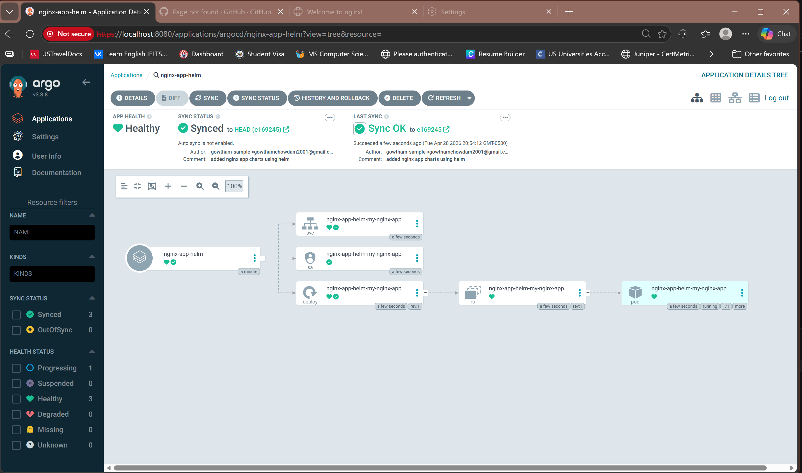
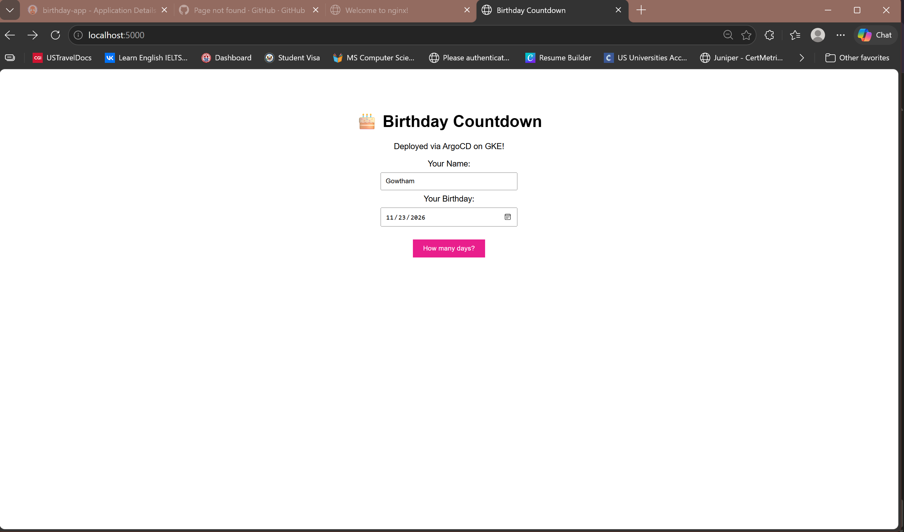

# GitOps with ArgoCD on k3d

A hands-on GitOps demo running ArgoCD on local Kubernetes clusters using k3d. This covers deploying apps, sync waves, lifecycle hooks, and multi-cluster setups — all from a single GitHub repo as the source of truth.

---

## Architecture

```
                        GitHub Repo
                   (source of truth)
                          │
                          │  watches for changes
                          ▼
              ┌───────────────────────┐
              │     argocd-cluster    │
              │                       │
              │   ArgoCD Server       │
              │   App Controller      │
              │   Repo Server         │
              └──────────┬────────────┘
                         │
              shared-k3d-network (Docker)
                         │
              ┌──────────▼────────────┐
              │   loony-dev-cluster   │
              │                       │
              │   nginx deployment    │
              │   configmaps          │
              │   services            │
              └───────────────────────┘
```

ArgoCD watches the GitHub repo. Any commit automatically syncs to the target cluster.

---

## What's in This Repo

| Folder | What it does |
|---|---|
| `nginx_yaml_files/` | Basic nginx deployment — good starting point |
| `my-nginx-app/` | Helm-based nginx app |
| `Birthday-app/` | Python web app with Dockerfile |
| `waves_demo/` | Ordered deployments using sync waves + hooks |

---

## Prerequisites

- [Docker Desktop](https://www.docker.com/products/docker-desktop/) with WSL2 integration enabled
- [k3d](https://k3d.io/)
- [kubectl](https://kubernetes.io/docs/tasks/tools/)
- [ArgoCD CLI](https://argo-cd.readthedocs.io/en/stable/cli_installation/)

---

## Setup

### 1. Create Clusters

> Both clusters must share the same Docker network so ArgoCD can reach the target cluster internally. This is the key fix for WSL2.

```bash
k3d cluster create argocd-cluster --network shared-k3d-network --agents 2
k3d cluster create loony-dev-cluster --network shared-k3d-network --agents 2
```

### 2. Install ArgoCD

```bash
kubectl config use-context k3d-argocd-cluster
kubectl create namespace argocd
kubectl apply -n argocd -f https://raw.githubusercontent.com/argoproj/argo-cd/stable/manifests/install.yaml
kubectl apply --server-side -f https://raw.githubusercontent.com/argoproj/argo-cd/stable/manifests/crds/applicationset-crd.yaml
```

### 3. Access the UI

```bash
kubectl port-forward svc/argocd-server -n argocd 8080:443

# Get the admin password
kubectl -n argocd get secret argocd-initial-admin-secret \
  -o jsonpath="{.data.password}" | base64 -d
```

Open https://localhost:8080

### 4. Register the Target Cluster

> On WSL2, ArgoCD pods can't reach `127.0.0.1`. The fix is to manually register the target cluster using its internal Docker network IP and a long-lived service account token.

Steps:
1. Get the target cluster's internal Docker IP via `docker inspect`
2. Create the `argocd-manager` service account on the target cluster
3. Create a long-lived token secret for that service account
4. Register the cluster in ArgoCD using a Kubernetes secret with the internal IP and bearer token

Refer to the [ArgoCD cluster registration docs](https://argo-cd.readthedocs.io/en/stable/operator-manual/declarative-setup/#clusters) for the secret format.

### 5. Deploy an App

```bash
argocd app create <app-name> \
  --repo https://github.com/<your-org>/<your-repo> \
  --path <folder-in-repo> \
  --dest-server https://<cluster-ip>:6443 \
  --dest-namespace default \
  --sync-policy automated
```

---

## Sync Waves & Hooks

Sync waves let you control the order resources are deployed. Hooks let you run jobs before or after a sync.

```
PreSync Hook → Wave 0 → Wave 1 → Wave 2 → PostSync Hook
  (checks)    (config)  (deploy)  (service)  (notify)
```

Set the order using annotations in your manifest:

```yaml
argocd.argoproj.io/sync-wave: "1"       # deployment order
argocd.argoproj.io/hook: PreSync         # lifecycle hook
```

See `waves_demo/` for a working example.

---

## Multi-Cluster with ApplicationSet

ApplicationSets let you deploy the same app to multiple clusters from a single definition. Add cluster entries to the generator list and ArgoCD automatically creates one app per cluster.

See [ArgoCD ApplicationSet docs](https://argo-cd.readthedocs.io/en/stable/user-guide/application-set/) for full reference.

---

## Screenshots

### Clusters registered and connected


### Sync waves in action


### Final output


---

## Key Takeaways

- **Shared Docker network** is essential for multi-cluster k3d setups on WSL2
- **Manual cluster secret** is the workaround when `argocd cluster add` can't connect due to WSL2 networking
- **Sync waves** give you fine-grained control over deployment order within a single sync
- **ApplicationSets** scale GitOps across multiple clusters with minimal config

---

## References

- [ArgoCD Docs](https://argo-cd.readthedocs.io/)
- [k3d Docs](https://k3d.io/)
- [Sync Waves](https://argo-cd.readthedocs.io/en/stable/user-guide/sync-waves/)
- [Resource Hooks](https://argo-cd.readthedocs.io/en/stable/user-guide/resource_hooks/)
- [ApplicationSets](https://argo-cd.readthedocs.io/en/stable/user-guide/application-set/)